# Ethernet LAN Switching

## What is a LAN ?
A Local Area Network is a network contained within a relatively small area.
LANs use L2 layer frames.

## Ethernet Frame

* 26 bytes :fire:

* `HEADER`
    * 22 bytes
    * `Preamble`
    * `SFD` (Start Frame Delimiter): used for syncronization and preparing the device to receive the rest of the data in the frame
    * `Destination`: L2 address to which the frame is being sent
    * `Source`: L2 address of the device that sent the frame
    * `Type` (or Length): indicates the L3 protocol used in the encapsulated `packet` (almsot always IPv4 or IPv6)

* `TRAILER`
    * 4 bytes
    * `FCS` (Frame Check Sequence): used by the receiving device to detect any errors that may have occurred in transmission
    

* 18 bytes without Preamble + SFD :fire: :fire: :fire:
* `Preamble + SFD` are usually not considered as part of the ethernet header
* **Minimum size for an Ethernet frame (Header + Payload [Packet] + Trailer) is 64 bytes** :fire:
* 64 bytes - 18 bytes (header + trailer) = 46 bytes for the **packet** (minimum)
* if payload is less than 46 bytes, padding bytes are added

### Preamble

* 7 bytes (8 bits * 7 = 56 bits)
* 10101010 * 7
* Allows deviced to sync their receiver clocks

### SDF (Start Frame Delimiter)

* 1 bytes (8 bits)
* 10101011
* Marks the end of the preable, and the beginning of the rest of the frame

### Destination and Source

* 6 bytes each (8 bits * 6 = 48 bit) address of physical device
* indicate the devices sending and receiving the frame
* consist of destination and source `MAC address`
* `MAC` = Media Access Control

### Type / Length

* 2 bytes (8 bits * 2 = 16 bits)
* value of `1500 or less` in this field indicates the LENGTH of the encapsulated packet in bytes
* value of `1536 or less` in this field indicates the `TYPE` of the encapsulated packet (usually IPv4 or IPv6), and the length is determined via other methods
* IPv4 = 0x0800 (Hexadecimal) = `2048` in decimal
* IPv6 = 0x86DD (Hexadecimal) = `34525` in decimal

### FCS (Frame Check Sequence)

* 4 bytes (32 bits) in length
* detects corrupted data by running a *"CRC"* algorithm over the receiving data
* `CRC`: "Cyclic Redundancy Check"

## MAC Address

* 6 bytes (48 bits) physical address assigned to the device when it is made
* A.K.A "Burned-in Address"
* Globally unique
* First 3 bytes are OUI (Organizationally Unique Identifier), which is assigned to the company making the device :fire:
* Last 3 bytes are unique to the device itself :fire:
* Written as 12 **hexadecimal** characters

## ARP

* stands for Address Resolution Protocol
* used to discover L2 address (MAC) of a known L3 address (IP)
* consists of two messages:
    * `ARP Request`
    * `ARP Reply`
* `ARP Request` is a `broadcast` ethernet frame (it is sent to all hosts in the network)
* `ARP Reply` is a `unicast` ethernet frame

### ARP Table

Use `arp -a` to view the ARP table and show all ARP entries

* `type static`: default entries
* `type dynamic`: learned via ARP

## Ping

* network utility used to test reachability
* measures round-trip time
* uses two messages:
    * `ICMP Echo Request`
    * `ICMP Echo Reply`
* command to use: `ping <ip_address>`

In the above example the first of the 5 requests sent failed because of ARP.

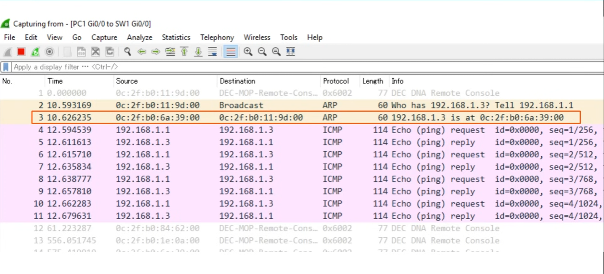

### Cisco IOS ARP

## MAC Address Table

To **show** the MAC Address table in CISCO devices use:

`show mac address-table`

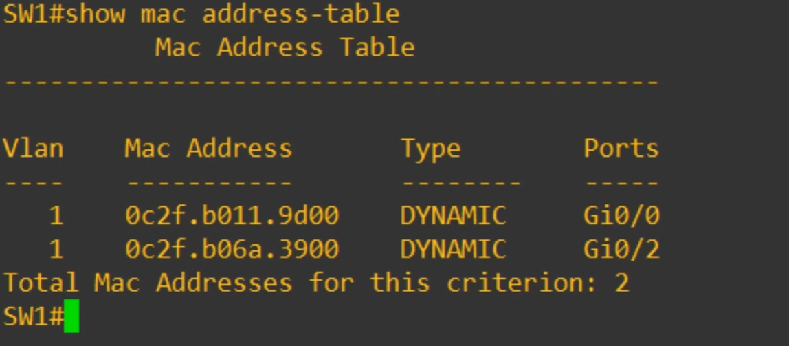

To manually **clear** the MAC Address table in CISCO devices use:

`clear mac address-table dynamic interface <interface name>`

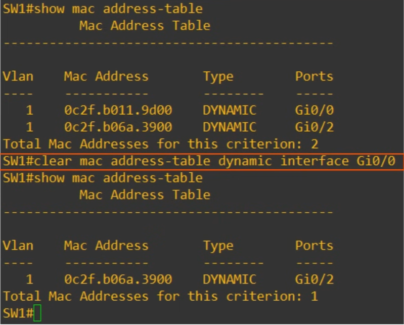

## Examples

### Example 1

We will have `PC1` send data to `PC2` in the same LAN where the Switch has an empty MAC Address Table

1. `PC1` sends an ethernet frame for `PC2`
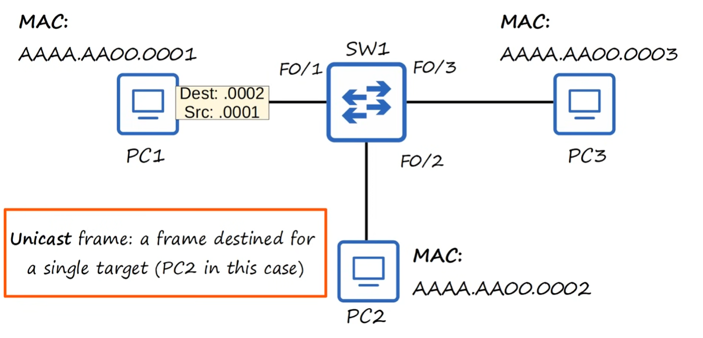

2. `SW1` learns `PC1` Mac Address and associates it to the F0/1 interface (**Dynamically learned MAC Address**)
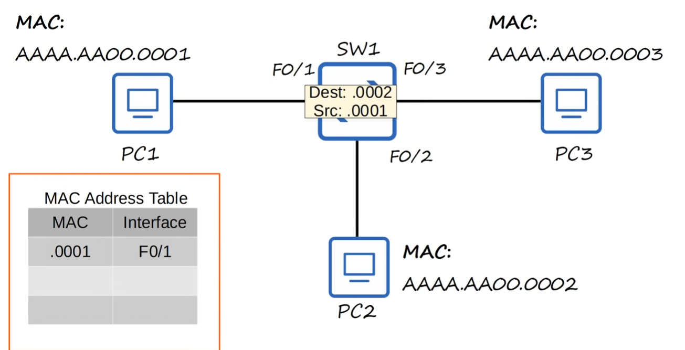

3. `SW1` doesn't know which device has the `PC2` MAC address, so it will `FLOOD` the frame
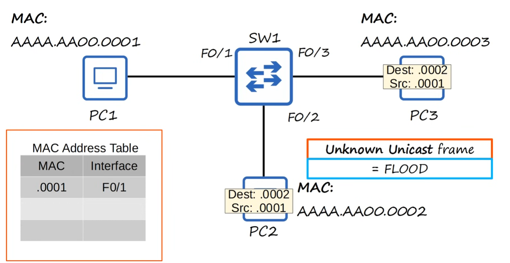

4. `PC2` receives the packet to process it normally up the OSI stack and `PC3` ignores the packet because the frame destination doesn't match its own MAC address
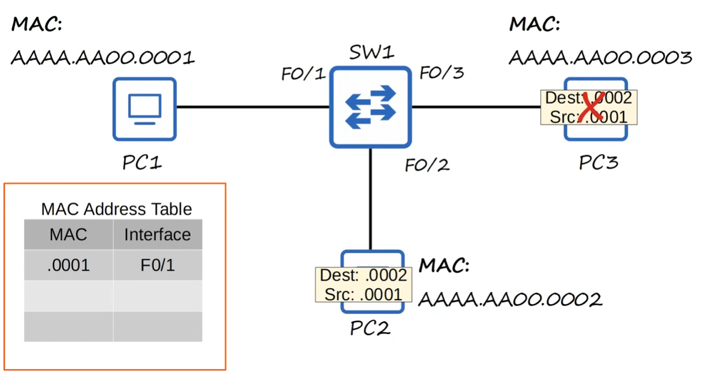

* `unicast frame`: frame destined for a single target
* `unknown unicast frame`: frame for which the switch doesn't have an entry in its MAC Address Table. In this case the frame is `FLOODED` (forwarded to all of its interfaces except the one it received the packet on)
* `known unicast frame`: frame for which destination is already "known" in the switches MAC Address Table. In this case the frame is `FORWARDED` to the specified destination.

### Example 2

`PC1` will send data to `PC3` and `PC3` will reply to `PC1` where the Switch has an empty MAC Address Table

1. `PC1` sends an ethernet frame for `PC3`
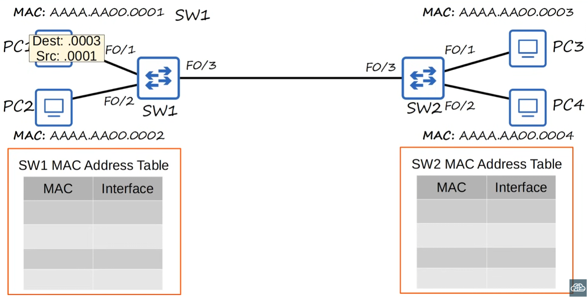

2. `SW1` saves `PC1` MAC Address and associates it to its `F0/1` interface

3. `SW1` `FLOODS` the frame and `PC2` drops the package

4. `SW2` saves `PC1` MAC Address and associates it to its `F0/3` interface, then `FLOODS` the frame and `PC4` drops the package while `PC3` processes it
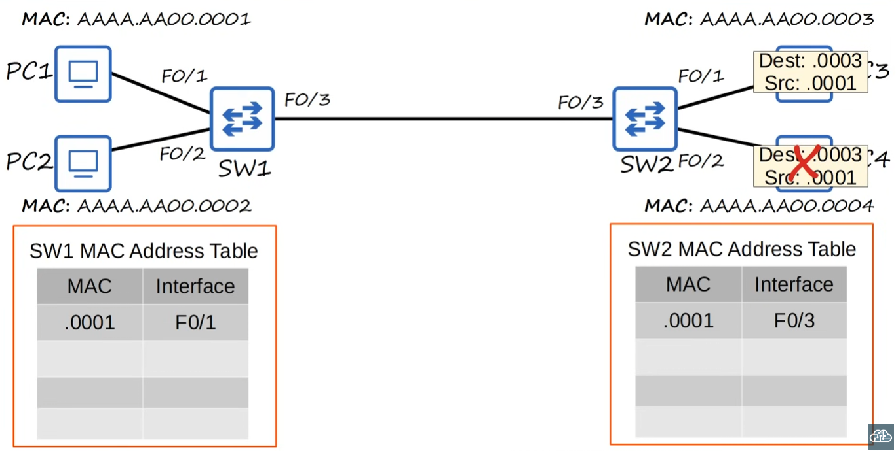

5. `PC3` replies to `PC1`

6. `SW2` saves `PC3` MAC Address and associates it to its `F0/1` interface
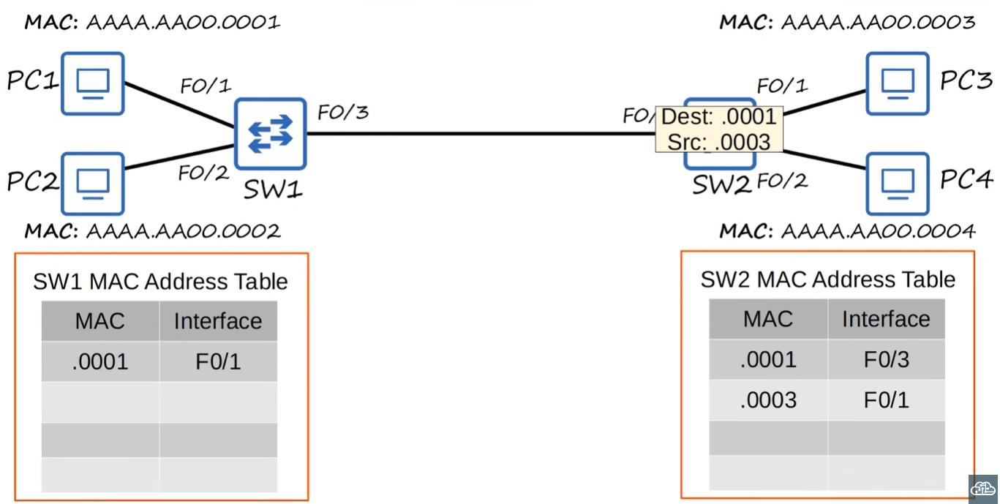

7. Since `SW2` already associated `PC1` MAC Address to the `F0/3` interface it will `FORWARD` the frame to `SW1`

8. `SW1` already associated `PC1` Mac Address to `F0/1` interface so it will `FORWARD` the frame to `PC1` directly
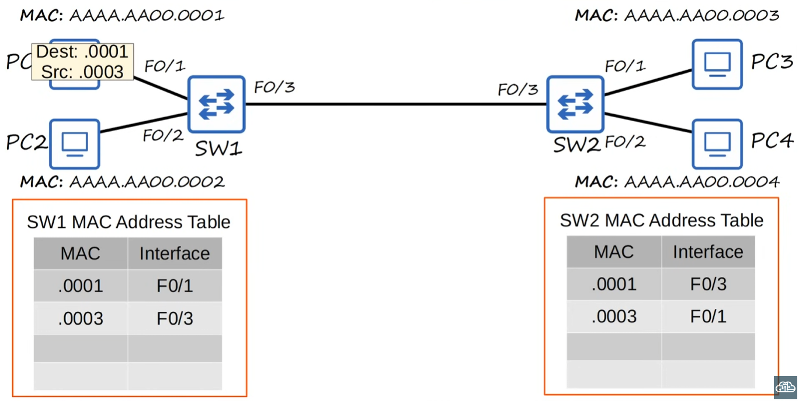

### Example 3 :fire:

`PC1` wants to send data to `PC3` where:
* `PC1` doesn't know `PC3` MAC Address
* `PC1` knows `PC3` IP address

1. Because `PC1` doesn't know `PC3` MAC address, it will send an **ARP Request** with its IP
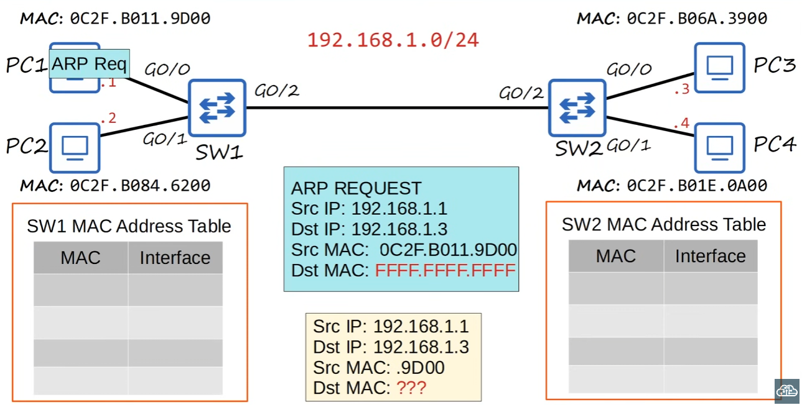

2. `SW1` adds `PC1` to its MAC Address table and `FLOODS` the request
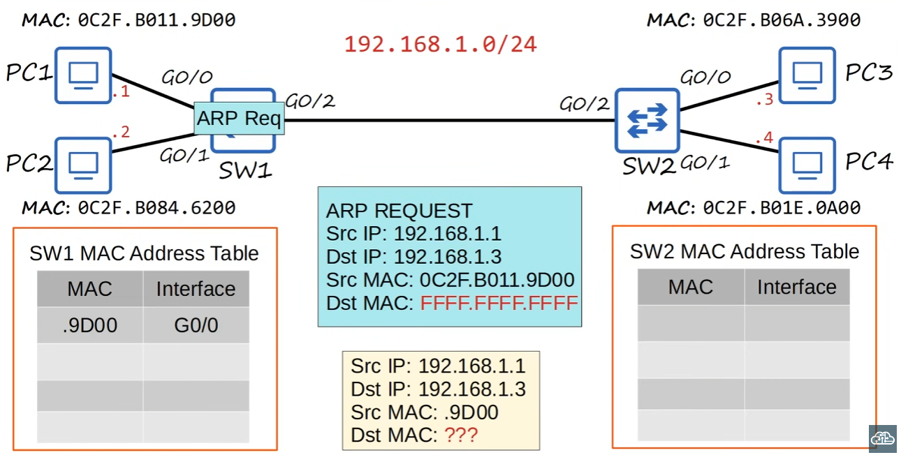

3. `PC2` ignores the request because Destination IP doesn't match 
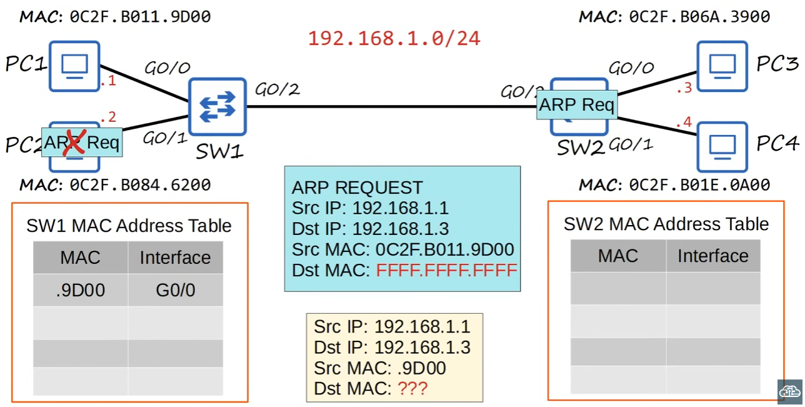

4. `SW2` adds `PC1` to its MAC Address table and `FLOODS` the request
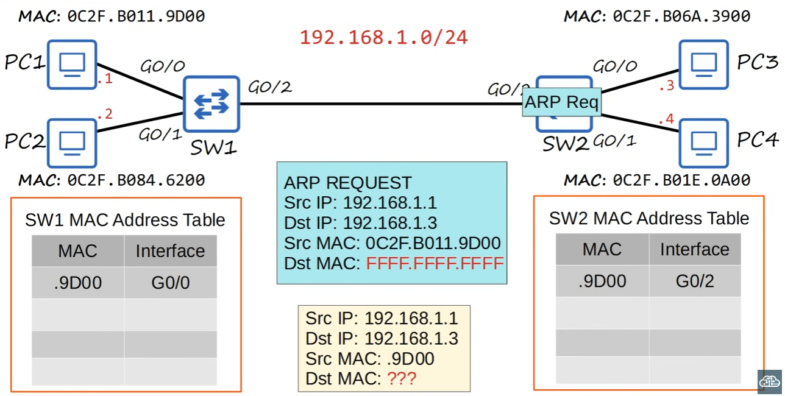

5. `PC2` ignores the request because Destination IP doesn't match and `PC3` processes it
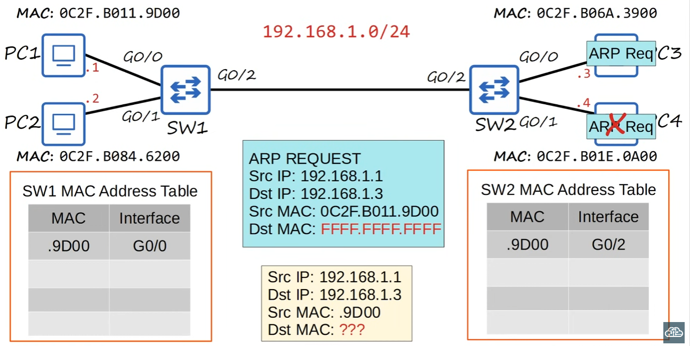

6. `PC3` sends the **ARP Reply**
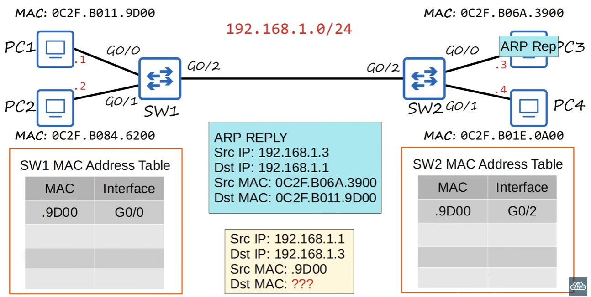

7. `SW2` adds `PC3` to its MAC Address table and `FORWARDS` the request
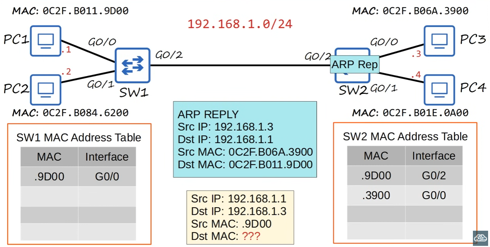

8. `SW1` adds `PC3` to its MAC Address table and `FORWARDS` the request
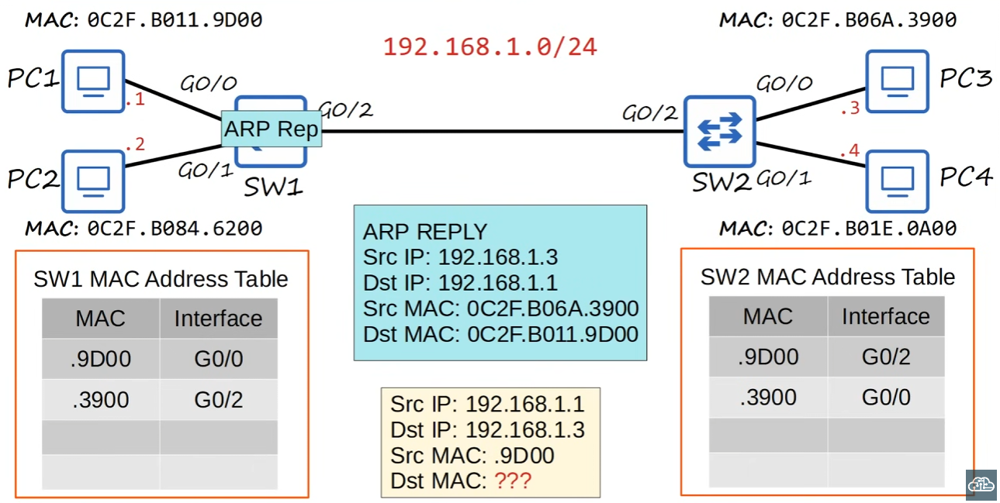

9. `PC1` receives the ARP reply and will add `PC3` MAC Address to its ARP table

