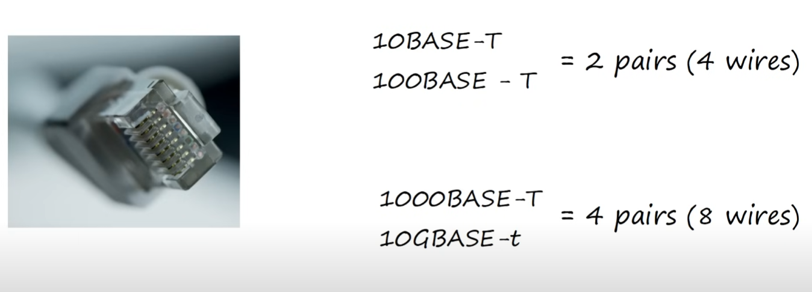
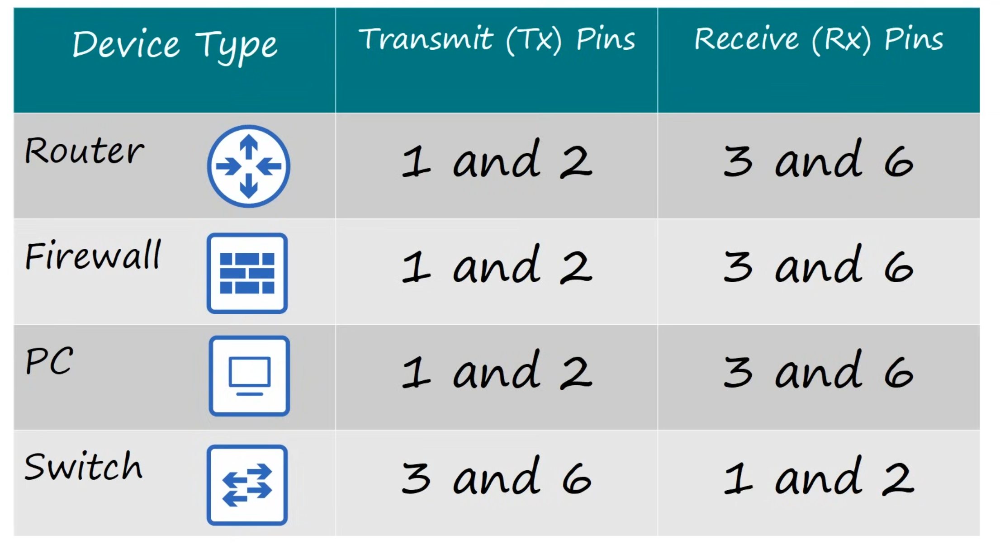
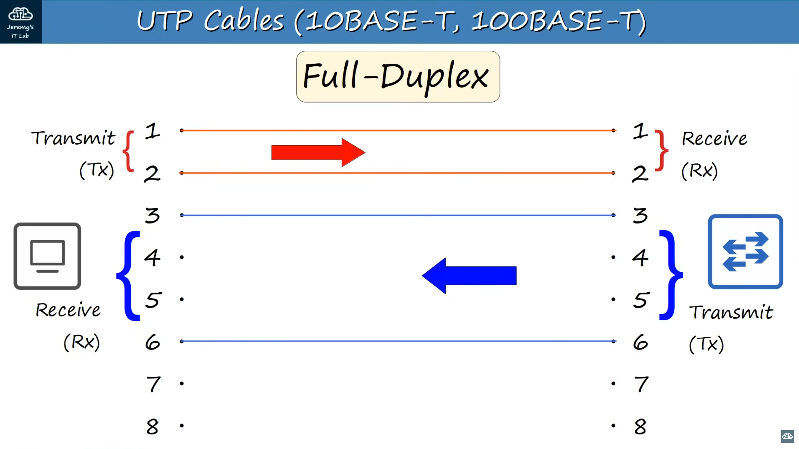
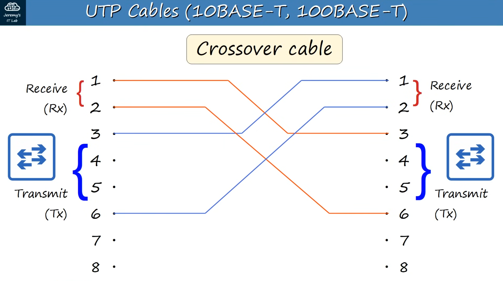
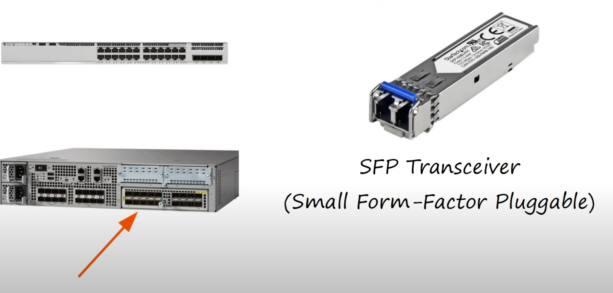
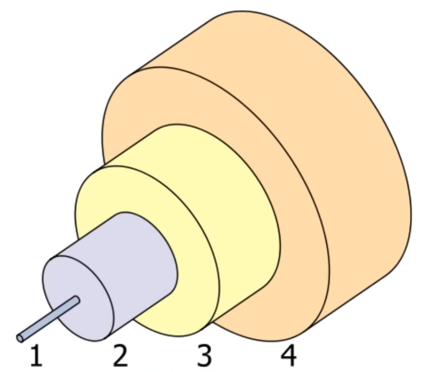
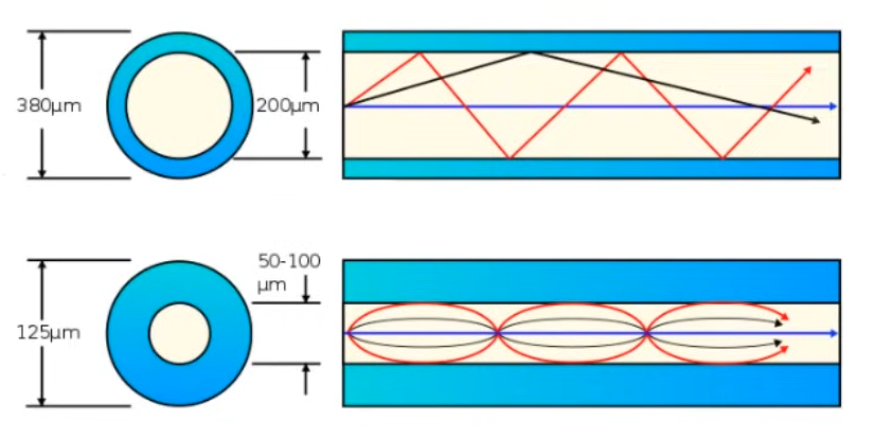
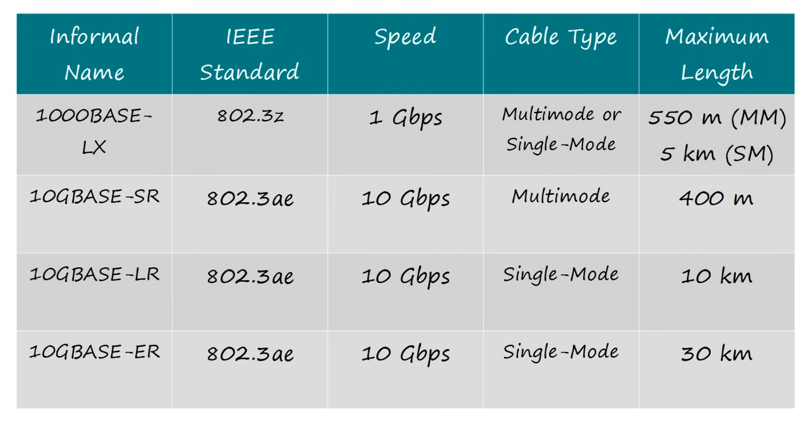

# Interfaces and Cables

## Table of contents

* [Network Protocols](#network-protocols)
* [Bits and Bytes](#bits-and-bytes)
* [Ethernet](#ethernet)
* [Ethernet Cable Standards](#ethernet-cable-standards)
* [UTP Cables](#utp-cables)
* [Copper UTP Cables](#copper-utp-cables)
* [Fiber-optic UTP Cables](#fiber-optic-utp-cables)
* [Fiber-optic Cable standards](#fiber-optic-cable-standards)
* [UTP vs Fiber-optic Cabling](#utp-vs-fiber-optic-cabling)

## Network Protocols

Agreed upon system of communicating between network devices.

## Bits and Bytes

* `Bit` = `0` or `1`
* `Byte` = `8 bits`

### Speed


## Ethernet

Collection of network protocols/standards that fit in RJ-45 ports (`RJ` = "Registered Jack")

## Ethernet Cable Standards

* defined in the IEEE 802.3 standard in 1983
* IEEE = Institute of Electrical and Electronics Engineers


Where `BASE` refers to baseband signaling (outside of CCNA scope) and `T` refers to `twisted pair`

## UTP Cables

Type of copper **cables** used in ethernet standards.

* `Unshielded` = no metallic shield, which makes them vulnerable to **electrical** interference
* `Twisted Pair` = Literaly 4 pairs of wires with each pair twisted together, protecting against EMI (**Electromagnetic** Interference)
* `8 pins`, perfect for the number of wires
* **Not all ethernet cables use all 8 wires**



## Copper UTP Cables

### 10BASE-T and 100BASE-T

* `Full-Duplex` transmission: both connected devices can receive and transmit data at the same time



#### Straight-through cable connections

```log
1 --- 1
2 --- 2

3 --- 3
6 --- 6
```



#### Crossover cable connections

```log
1 --- 3
2 --- 6

3 --- 1
6 --- 2
```



#### **Auto MDI-X** 🔥

Truth is that most modern network devices don't need to worry about straight-through or crossover cables because of Auto MDI-X.

It allows deviced to automatically detect which pins their neighbor is transmiting data on, and then adjust which pins to use to transmit/receive data.

### 1000BASE-T and 10GBASE-T

In addition to using **ALL** pairs of wires, each pair is `BI-DIRECTIONAL`. This is part of the reason why they can operate at much faster speeds.

```log
1 --- 1
2 --- 2

3 --- 3
6 --- 6

4 --- 4
5 --- 5

7 --- 7
8 --- 8
```

## Fiber-optic UTP Cables



### Connections




* `1` : Fiber glass core, where light is transmitted
* `2` : Cladding that reflects light
* `3` : Protective buffer
* `4` : Outer jacket of the cable

#### Single-mode

* Narrower core than multimode
* Single angle (mode) from laser-based transmitter
* Allows longer cables than UTP and multimode
* More expensive than    multimode fiber (**laser-based sfp transmitters**)


#### Multimode

* Wider fiber glass core than single-mode fiber
* Allows multiple angles (modes) of light waves to enter the fiber glass core
* Allows longer cables than UTP
* Shorter cables than single-mode fiber
* Cheaper than single-mode fiber (**led-based sfp transmitters**)



## Fiber-optic Cable standards



## UTP vs Fiber-optic Cabling

| UTP | Fiber-optic |
| --- | --- |
| Cheaper | More expensive |
| Shorter max distance (~100m) | longer max distance |
| Vulnerable to EMI | EMI proof |
| RJ45 ports are cheaper than SFP ports | SFP ports are more expensive (and single-mode ir more expensive than multimode) |
| Leak faint signal outside of cable (security risk) | No signal leak |
