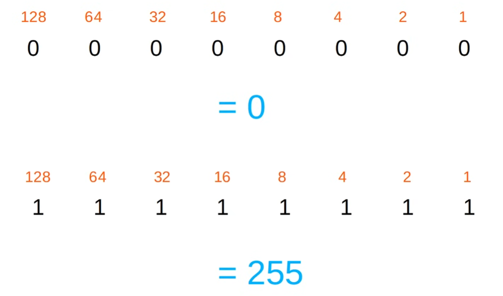

# IPv4 Addressing

## Table of contents
* [IPv4 Address](#ipv4-address)
* [Decimal and Binary](#decimal-and-binary)
* [IPv4 Address Classes](#ipv4-address-classes)

## IPv4 Address

* `32 bits` / `4 bytes`
* We use **dotted decimal** instead of binary for ease of use
    * `192.168.1.254` = `11000000.10101000.00000001.11111110`
* **CIDR notation**: `/24` after the IP number indicates `24` out of the `32` bits in an IP address correspond to the network portion. Possible values are `1 > n > 32` where `n` is an integer. 🔥🔥🔥
    * i.e `192.168.1.0/24`

## Decimal and Binary

### Binary to Decimal

### Decimal to Binary

## IPv4 Address Classes

| Class | First octet | First octet numeric range |
| :-: | :-: | :-: |
| **A** | 0xxxxxxx | 0-127 |
| **B** | 10xxxxxx | 128-191 |
| **C** | 110xxxxx | 192-223 |
| **D** | 1110xxxx | 224-239 |
| **E** | 1111xxxx | 240-255 |

* `A` class range end is usually considered `126` because `127` first octet is used to test the **network stack (l3)** on the local device
* We will focus on `A`, `B` and `C`.
* `D` are multicast addresses
* `E` are reserved (experimental)

| Class | First octet | First octet numeric range | Prefix Length |
| :-: | :-: | :-: | :-: |
| **A** | 0xxxxxxx | 0-127 | /8 |
| **B** | 10xxxxxx | 128-191 | /16 |
| **C** | 110xxxxx | 192-223 | /24 |

### Netmask

| Class | Prefix Length | Netmask | Binary octets |
| :-: | :-: | :-: | :-: |
| **A** | /8 | 255.0.0.0 | 11111111 00000000 00000000 00000000 |
| **B** | /16 | 255.255.0.0 | 11111111 11111111 00000000 00000000 |
| **C** | /24 | 255.255.255.0 | 11111111 11111111 11111111 00000000 |

### Network address

`192.168.1.0/24`

* `/24` means `192.168.1` is the network portion and `.0` is the host portion
* Since the **host portion** is `0` it means it is the network address
* it is the first address with a **host portion** of all `0`s

### Broadcast address

`192.168.1.255/24`

* last address in the network
* with `/24` net mask it would be the last octet `.255`
* cannot be assigned to a host
